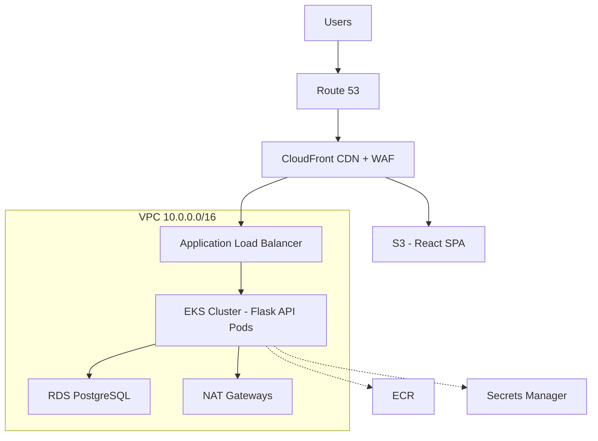
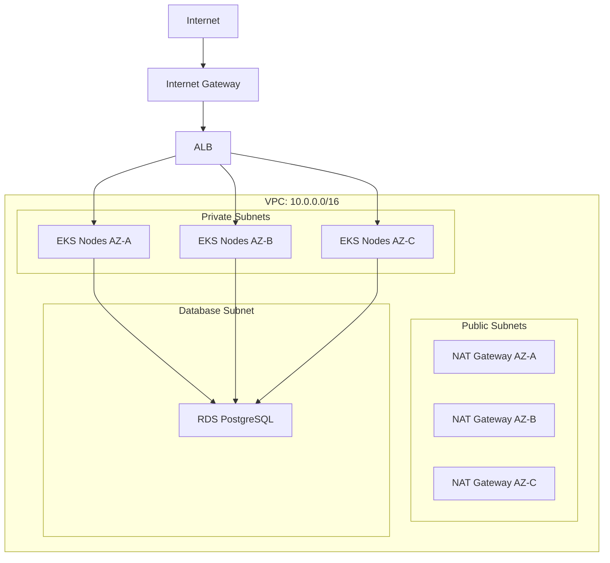
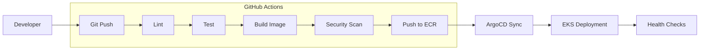

# Innovate Inc. Cloud Infrastructure Architecture

## Overview

This document outlines the cloud infrastructure for Innovate Inc.'s web application (React frontend + Flask API + PostgreSQL) on **AWS** using **Amazon EKS**.

**Design Principles:** Security-first, scalable (hundreds to millions of users), cost-optimized, GitOps-driven.

---

## Architecture Diagram

**Traffic Flow:**
1. Users → Route 53 → CloudFront (CDN + WAF)
2. Static content → S3 (React SPA)
3. API requests → ALB → EKS → RDS

---

## 1. Cloud Environment Structure

**2 AWS Accounts:**

| Account | Purpose |
|---------|---------|
| Management | Billing, Organizations, CI/CD, ECR, shared tooling |
| Workloads | EKS cluster, RDS, application infrastructure |

**Why 2 accounts?**
- Simple for a startup with limited resources
- Clear separation: management/tooling vs. application
- Cost visibility between shared services and workloads
- Can expand to 4 accounts later (separate Dev/Prod) when compliance requires

---

## 2. Network Design

**Key Points:**
- 3 Availability Zones for high availability
- EKS nodes in private subnets (no public IPs)
- NAT Gateway per AZ for outbound traffic
- Database in isolated subnet

**Security:**
- Security Groups: ALB → EKS (port 8080) → RDS (port 5432)
- AWS WAF on CloudFront (OWASP rules, rate limiting)
- VPC Flow Logs enabled

---

## 3. Compute Platform (EKS)

**Cluster Configuration:**
- Kubernetes 1.33 (AWS managed control plane)
- Secrets encrypted with KMS
- Logs to CloudWatch

**Node Groups:**

| Group | Instance | Scaling | Purpose |
|-------|----------|---------|---------|
| System | t3.medium | 2-3 fixed | Cluster add-ons, ingress |
| Application | t3.large | 2-20 auto | Flask API workloads |

**Scaling:**
- **HPA** (Horizontal Pod Autoscaler): Scales pods based on CPU/memory (2-100 pods)
- **Cluster Autoscaler**: Scales nodes when pods can't be scheduled. Can be Karpenter.

---

## 4. Database (RDS PostgreSQL)

**Configuration:**
- PostgreSQL 15, db.t3.medium instance
- 100GB gp3 SSD storage
- Encryption at rest (KMS)
- Single-AZ initially (Multi-AZ when HA needed)

**Backups:**
- Automated daily backups (14-day retention)
- Point-in-time recovery enabled
- Manual snapshots before major deployments

---

## 5. CI/CD Pipeline

**Key Components:**
- **GitHub Actions**: Build, test, scan, push to ECR
- **ArgoCD**: GitOps - syncs K8s manifests from Git to cluster
- **Rolling updates**: Zero-downtime deployments

**Linting/Scanning:**
- flake8 (style), black (formatting), mypy (types), bandit (security), Trivy (container scanning)

---

## 6. Security

| Layer | Implementation |
|-------|----------------|
| Edge | CloudFront, WAF, Shield |
| Network | Private subnets, Security Groups, NACLs |
| Application | K8s RBAC, Network Policies, Pod Security Standards |
| Data | KMS encryption, Secrets Manager, IRSA |
| Monitoring | CloudTrail, GuardDuty, VPC Flow Logs |

**Secrets Management:**
- AWS Secrets Manager for database credentials
- IRSA (IAM Roles for Service Accounts) - pods assume IAM roles, no stored credentials

---

## 7. Monitoring

| Type | Tool |
|------|------|
| Logging | CloudWatch Logs |
| Alerting | CloudWatch Alarms → SNS |

**Key Alerts:** Error rate >1%, latency p99 >2s, CPU/memory >80%

---

## 8. Cost Estimate

| Service | Monthly Cost |
|---------|--------------|
| EKS Control Plane | $73 |
| EC2 (2x t3.large) | $120 |
| RDS (db.t3.medium) | $65 |
| NAT Gateways (3x) | $100 |
| ALB | $25 |
| CloudFront + S3 | $15 |
| CloudWatch | $30 |
| **Total** | **~$430/month** |

---

## 9. Future Considerations

As traffic grows:
1. Enable RDS Multi-AZ for high availability
2. Migrate to Aurora PostgreSQL for performance
3. Add ElastiCache (Redis) for caching
4. Multi-region deployment for global users
5. Expand to 4 AWS accounts (separate Dev/Prod) for compliance

---

## Quick Reference

| Component | Choice | Why |
|-----------|--------|-----|
| Cloud | AWS | Market leader, mature services |
| Orchestration | EKS | Kubernetes portability, ecosystem |
| Database | RDS PostgreSQL | Managed, cost-effective |
| CI/CD | GitHub Actions + ArgoCD | Native integration, GitOps |
| Secrets | Secrets Manager + IRSA | No stored credentials |
| CDN | CloudFront | AWS integration, global edge |